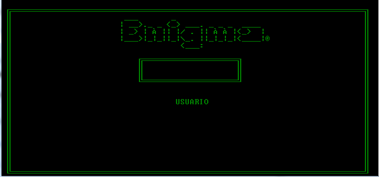
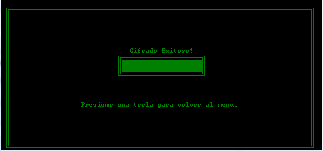

# Proyecto Enigma

Sistema de cifrado y descifrado de mensajes de texto que implementa cuatro algoritmos criptográficos clásicos, desarrollado en lenguaje C para la plataforma Windows.

## Descripción

EnigmaProject es un programa de consola que permite a los usuarios cifrar y descifrar mensajes utilizando distintos métodos de encriptación. El proyecto fue elaborado como proyecto final del curso de Fundamentos de Programación en la Universidad Autónoma de Yucatán.

## Características

- **4 algoritmos de cifrado:** Simple (César), XOR, Vigenère y Run-Length Encoding
- **Interfaz visual:** Menús navegables con teclado, iconos ASCII art y animaciones
- **Sistema de autenticación:** Acceso restringido con usuario
- **Guardado automático:** Los mensajes cifrados se almacenan en `mensaje.txt`

## Capturas de Pantalla

| Login | Menú Principal |
|-------|----------------|
|  |  |

| Selección de Cifrado | Entrada de Texto |
|----------------------|------------------|
|  |  |

| Cifrando | Mensaje Cifrado |
|----------|-----------------|
|  |  |

| Descifrando | Mensaje Descifrado |
|-------------|-------------------|
|  |  |

## Requisitos

- **Sistema operativo:** Windows (usa API de Windows: `windows.h`, `conio.h`)
- **Compilador:** GCC (MinGW/MSYS2) o Microsoft Visual C++ (cl.exe)

## Compilación

### Con GCC (recomendado)

```bash
make
```

El ejecutable se genera en `build/EnigmaProject.exe`.

### Con Microsoft Visual C++

```batch
cl main.c src\utils\console.c src\ui\screens.c src\ui\icons.c src\ui\animations.c src\algorithms\simple.c src\algorithms\run_length.c src\algorithms\xor.c src\algorithms\vigenere.c /Fe:build\EnigmaProject.exe /Iinclude
```

### Limpiar archivos compilados

```bash
make clean
```

Esto elimina la carpeta `build/` completamente.

## Uso

1. Ejecutar `build/EnigmaProject.exe`
2. Ingresar el usuario: **FMAT**
3. Navegar con las teclas de dirección (↑ ↓ ← →)
4. Seleccionar opción con **Enter**
5. Para regresar a un menú anterior, presionar **Esc**

## Estructura del Proyecto

```
Proyecto-Enigma/
├── main.c                          # Punto de entrada del programa
├── Makefile                        # Archivo de compilación
├── include/
│   └── enigma.h                    # Header principal (enums, constantes, prototipos)
├── src/
│   ├── utils/
│   │   └── console.c               # Funciones de utilidad de consola
│   ├── ui/
│   │   ├── screens.c               # Pantallas de interfaz de usuario
│   │   ├── icons.c                 # Iconos ASCII art
│   │   └── animations.c           # Animaciones de carga y transición
│   └── algorithms/
│       ├── simple.c                # Cifrado simple (César) + entrada de texto
│       ├── xor.c                   # Cifrado XOR
│       ├── vigenere.c              # Cifrado Vigenère
│       └── run_length.c           # Run-Length Encoding (compresión)
├── build/                          # Archivos de compilación (excluido del repositorio)
│   ├── EnigmaProject.exe
│   └── ...
├── archive/
│   └── EnigmaProject-ver_1.0.c     # Código fuente original (backup)
├── docs/
│   ├── media/                      # Capturas de pantalla
│   ├── ARCHITECTURE.md             # Arquitectura del código
│   ├── ALGORITHMS.md               # Descripción de algoritmos
│   ├── INSTALLATION.md             # Guía de instalación
│   └── USER_GUIDE.md               # Manual de usuario
└── .gitignore
```

Para más detalles, consulte la documentación en la carpeta [`docs/`](docs/).

## Algoritmos Implementados

| Algoritmo | Tipo | Descripción |
|-----------|------|-------------|
| Simple (César) | Sustitución | Desplaza cada carácter 3 posiciones en ASCII |
| XOR | Bitwise | Opera cada bit con una clave binaria de 8 bits |
| Vigenère | Polialfabético | Sustitución con clave repetitiva de hasta 4 letras |
| Run-Length | Compresión | Reemplaza secuencias repetidas con `#caracternum` |

Consulte [`docs/ALGORITHMS.md`](docs/ALGORITHMS.md) para una explicación detallada de cada algoritmo.

## Documentación

| Documento | Descripción |
|-----------|-------------|
| [`docs/ARCHITECTURE.md`](docs/ARCHITECTURE.md) | Arquitectura y diseño del código |
| [`docs/ALGORITHMS.md`](docs/ALGORITHMS.md) | Explicación detallada de cada algoritmo |
| [`docs/INSTALLATION.md`](docs/INSTALLATION.md) | Guía de instalación y compilación |
| [`docs/USER_GUIDE.md`](docs/USER_GUIDE.md) | Manual de usuario |

## Desarrolladores

- **Arias Morales Marvin**
- **Canul Flota Ricardo**
- **Cordova Villamil Jorge**
- **Pool Alvarado Marco**

Universidad Autónoma de Yucatán - 2026

## Licencia

Proyecto académico. El código se distribuye con fines educativos.
