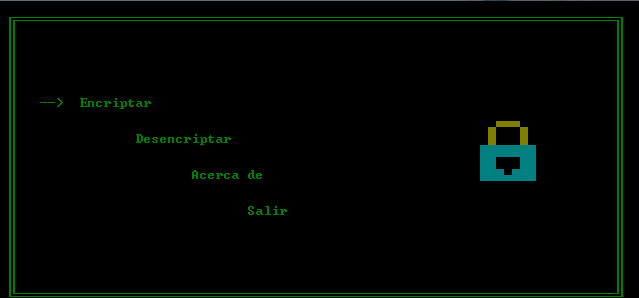
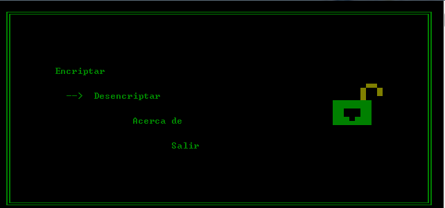
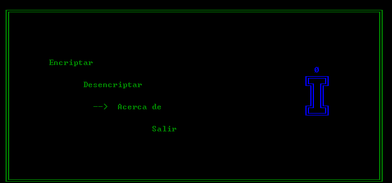
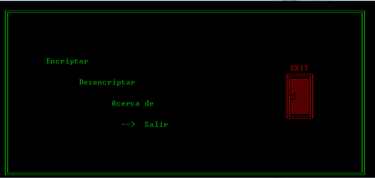
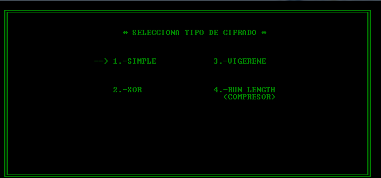
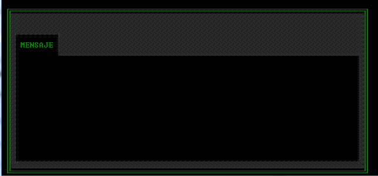

# EnigmaProject

Text message encryption and decryption system implementing four classic cryptographic algorithms, developed in C for the Windows platform.

## Description

EnigmaProject is a console program that allows users to encrypt and decrypt messages using different encryption methods. The project was created as a final project for the Fundamentals of Programming course at Universidad Autonoma de Yucatan.

## Features

- **4 encryption algorithms:** Simple (Caesar), XOR, Vigenere and Run-Length Encoding
- **Visual interface:** Navigable keyboard menus, ASCII art icons and animations
- **Authentication system:** Restricted access with username
- **Auto-save:** Encrypted messages are stored in `mensaje.txt`

## Screenshots

| Login | Main Menu (Encrypt) |
|-------|---------------------|
|  |  |

| Main Menu (Decrypt) | Main Menu (About) |
|----------------------|-------------------|
|  |  |

| Main Menu (Exit) | Cipher Selection |
|--------------------|------------------|
|  |  |

| Text Input | Encryption Successful |
|------------|-----------------------|
|  |  |

## Requirements

- **Operating System:** Windows (uses Windows API: `windows.h`, `conio.h`)
- **Compiler:** GCC (MinGW/MSYS2) or Microsoft Visual C++ (cl.exe)

## Compilation

### With GCC (recommended)

```bash
make
```

The executable is generated in `build/EnigmaProject.exe`.

### With Microsoft Visual C++

```batch
cl main.c src\utils\console.c src\ui\screens.c src\ui\icons.c src\ui\animations.c src\algorithms\simple.c src\algorithms\run_length.c src\algorithms\xor.c src\algorithms\vigenere.c /Fe:build\EnigmaProject.exe /Iinclude
```

### Clean compiled files

```bash
make clean
```

This removes the `build/` folder completely.

## Usage

1. Run `build/EnigmaProject.exe`
2. Enter the username: **FMAT**
3. Navigate with arrow keys (up down left right)
4. Select option with **Enter**
5. To return to a previous menu, press **Esc**

## Project Structure

```
Proyecto-Enigma/
├── main.c                          # Program entry point
├── Makefile                        # Build file
├── include/
│   └── enigma.h                    # Main header (enums, constants, prototypes)
├── src/
│   ├── utils/
│   │   └── console.c               # Console utility functions
│   ├── ui/
│   │   ├── screens.c               # User interface screens
│   │   ├── icons.c                 # ASCII art icons
│   │   └── animations.c           # Loading and transition animations
│   └── algorithms/
│       ├── simple.c                # Simple encryption (Caesar) + text input
│       ├── xor.c                   # XOR encryption
│       ├── vigenere.c              # Vigenere encryption
│       └── run_length.c           # Run-Length Encoding (compression)
├── build/                          # Compiled files (excluded from repository)
│   ├── EnigmaProject.exe
│   └── ...
├── archive/
│   └── EnigmaProject-ver_1.0.c     # Original source code (backup)
├── docs/
│   ├── media/                      # Screenshots
│   ├── ARCHITECTURE.md             # Code architecture
│   ├── ALGORITHMS.md               # Algorithm descriptions
│   ├── INSTALLATION.md             # Installation guide
│   └── USER_GUIDE.md               # User manual
└── .gitignore
```

For more details, see the documentation in the [`docs/`](docs/) folder.

## Implemented Algorithms

| Algorithm | Type | Description |
|-----------|------|-------------|
| Simple (Caesar) | Substitution | Shifts each character 3 positions in ASCII |
| XOR | Bitwise | Operates each bit with an 8-bit binary key |
| Vigenere | Polyalphabetic | Substitution with repetitive key of up to 4 letters |
| Run-Length | Compression | Replaces repeated sequences with `#characternum` |

See [`docs/ALGORITHMS.md`](docs/ALGORITHMS.md) for a detailed explanation of each algorithm.

## Documentation

| Document | Description |
|----------|-------------|
| [`docs/ARCHITECTURE.md`](docs/ARCHITECTURE.md) | Code architecture and design |
| [`docs/ALGORITHMS.md`](docs/ALGORITHMS.md) | Detailed explanation of each algorithm |
| [`docs/INSTALLATION.md`](docs/INSTALLATION.md) | Installation and compilation guide |
| [`docs/USER_GUIDE.md`](docs/USER_GUIDE.md) | User manual |

## Developers

- **Arias Morales Marvin**
- **Canul Flota Ricardo**
- **Cordova Villamil Jorge**
- **Pool Alvarado Marco**

Universidad Autonoma de Yucatan - 2026

## License

Academic project. The code is distributed for educational purposes.
