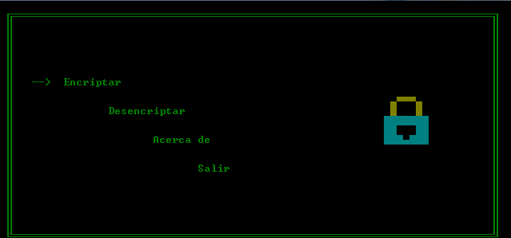
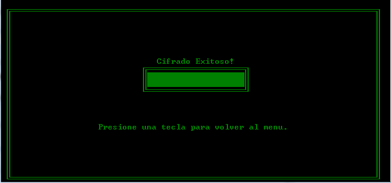

# Proyecto-Enigma

Proyecto Enigma es un programa que utiliza algunos metodos de cifrado para cifrar y descifrar mensajes de texto.

Este programa está escrito en C y corre unicamente en Windows debido a que usa ciertas librerias de Windows como los colores de la terminal, el programa fue elaborado como proyecto final de un curso de fundamentos de programacion en la universidad, pero los algoritmos pueden ser adaptados a otro lenguaje o mejorados por lo que dejo el codigo a disposicion del la comunidad

PS: El usuario para abrir el programa despues de compilarlo es "FMAT"

Capturas

